# Markdown Links

## Índice

* [1. Prefácio](#1-prefácio)
* [2. Resumo do projeto](#2-resumo-do-projeto)
* [3. Funcionalidades](#3-funcionalidades)
* [4. Instruções de instalação e uso](#4-instruções-de-instalação-e-uso)
* [5. Mensagens de erro](#5-mensagens-de-erro)
* [6. Testes unitários](#6-testes-unitários)
* [7. Considerações técnicas](#7-considerações-técnicas)
* [8. Fluxograma](#8-fluxograma)
* [9. Contato](#9-contato)

***

## 1. Prefácio

[Markdown](https://pt.wikipedia.org/wiki/Markdown) é uma linguagem de marcação
muito popular entre os programadores. É usada em muitas plataformas que
manipulam texto (GitHub, fórum, blogs e etc) e é muito comum encontrar arquivos
com este formato em qualquer repositório (começando pelo tradicional
`README.md`).

Os arquivos `Markdown` normalmente contém _links_ que podem estar
quebrados, ou que já não são válidos, prejudicando muito o valor da
informação que está ali.

Uma comunidade open source nos propôs criar uma ferramenta, usando
[Node.js](https://nodejs.org/), que leia e analise arquivos no formato
`Markdown`, para verificar os arquivos que contenham links e mostrar algumas
estatísticas.

## 2. Resumo do projeto

Neste projeto, foi criada uma ferramenta de linha de comando (CLI), utilizando o Node.js, assim como
a sua própria biblioteca (library) em Javascript. 

Essa ferramenta analisa um arquivo markdown e retorna no terminal a lista de links presentes nele, assim como a rota do arquivo, a URL e o texto do link. É possível também validar e ver as estatísticas de cada link.

## 3. Funcionalidades

As funcionalidades presentes nessa ferramenta são:

* `Listagem dos links:` exibe no terminal os links encontrados em um arquivo _Markdown_, mostrando o texto do link, sua URL e a rota do arquivo em que se encontra. 

* `Validação dos links:` verifica se os links presentes no arquivo _Markdown_ estão funcionando corretamente. No terminal são exibidos a rota do arquivo, o texto do link, a URL, uma mensagem personalidada com OK, se estiver válido, ou FAIL, se estiver inválido, e o código HTTP referente a cada link.

* `Estatísticas dos links`: exibe a quantidade de links encontrados no arquivo, quantos deles são únicos e quantos são inválidos.

Obs: é possível ver a validação e as estatísticas tanto de forma separada quanto juntas.

## 4. Instruções de instalação e uso

Para instalar a biblioteca, execute o seguinte comando no seu terminal: `npm install md-links-bruabreu`

Após a instalação é possível executar os seguintes comandos:

`md-links ./nomeDoDiretório` ou `md-links ./nomeDoDiretório/nomeDoArquivo.md`

Esse comando retorna a lista de todos os links presentes em um arquivo .md. Se um arquivo não possui nenhum link é retornada uma mensagem de erro.

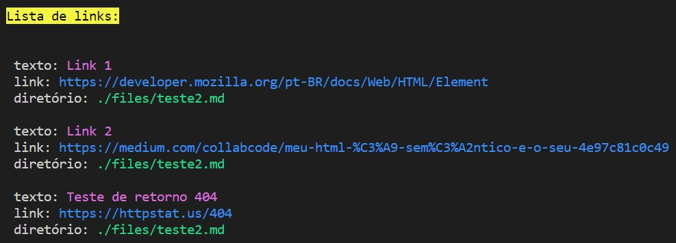

`md-links ./nomeDoDiretório --stats` ou `md-links ./nomeDoDiretório/nomeDoArquivo.md --stats`

Ao adicionar a opção --stats na frente do caminho do diretório ou arquivo, o terminal irá exibir as estatísiticas dos links, mostrando quantos links o arquivo possui, e qual a quantidade de links únicos.

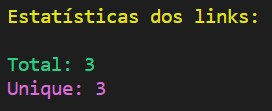

`md-links ./nomeDoDiretório --validate` ou `md-links ./nomeDoDiretório/nomeDoArquivo.md --validate`

Se você adicionar a opção --validate na frente do caminho do diretório ou arquivo, o terminal imprimirá uma lista com todos os links validados.

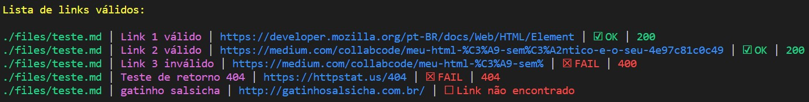

`md-links ./nomeDoDiretório --stats --validate` ou `md-links ./nomeDoDiretório/nomeDoArquivo.md --stats --validate`

Se tanto a opção --stats quanto a --validate forem adiionadas, além da informação do total de links e dos links únicos, será retornado quantos desses links estão quebrados.

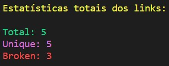

## 5. Mensagens de erro

* Caso o arquivo indicado não tenhe extensão .md

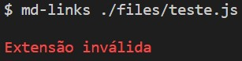

* Caso o arquivo indicado não tenha links

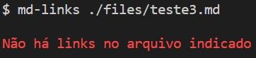

* Caso o arquivo ou diretório não exista

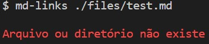

## 6. Testes unitários

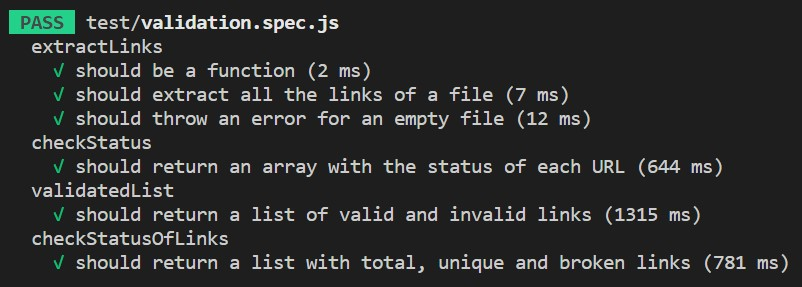
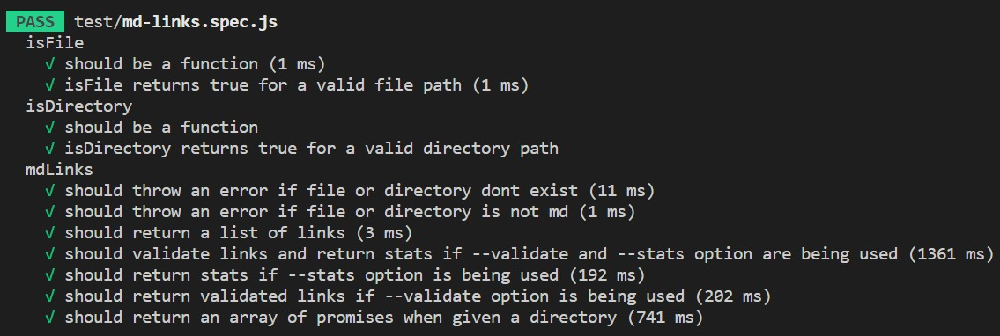
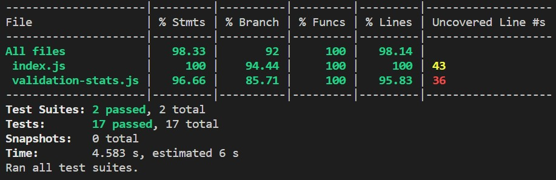

## 7. Considerações técnicas

**Tecnologias utilizadas:** JavaScript | Node.js

**Programas/Ferramentas utilizadas:** VSCode (codificação) | Trello (planejamento)

## 8. Fluxograma

Para dar início ao projeto foi feito um fluxograma que ajudou a dar os primeiros passos

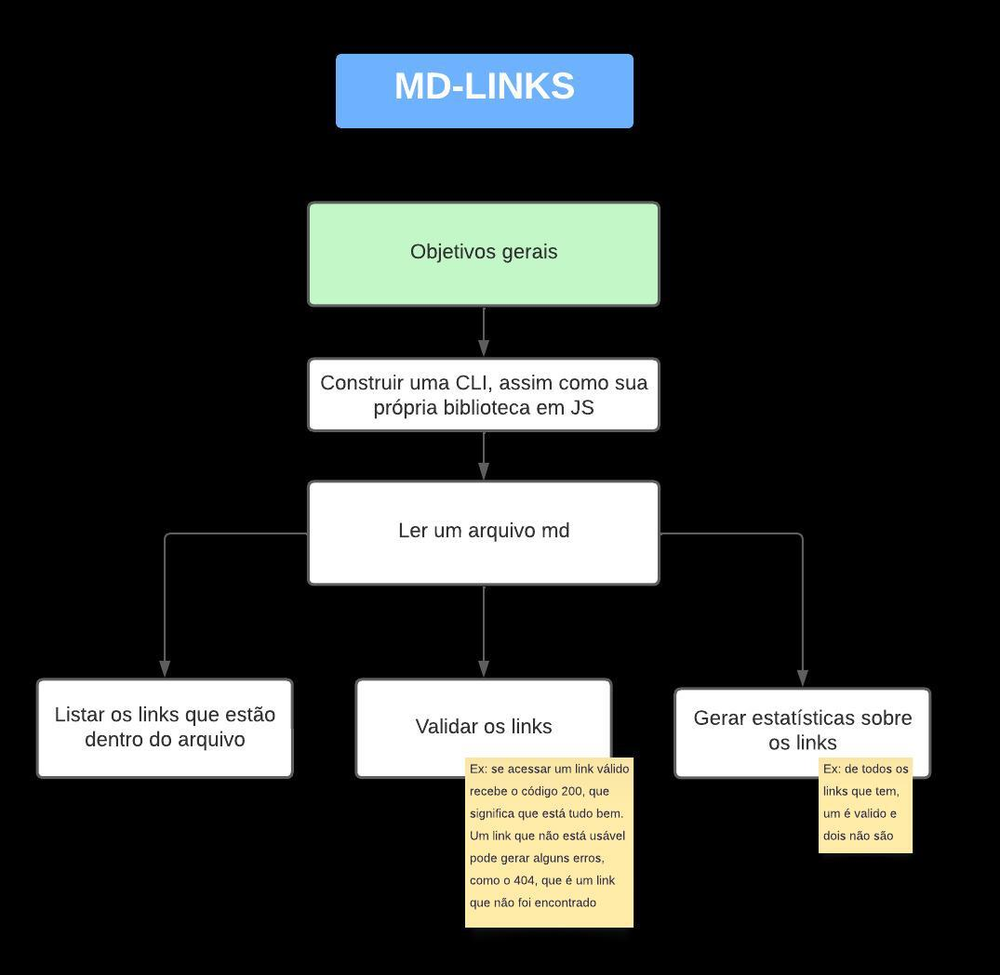
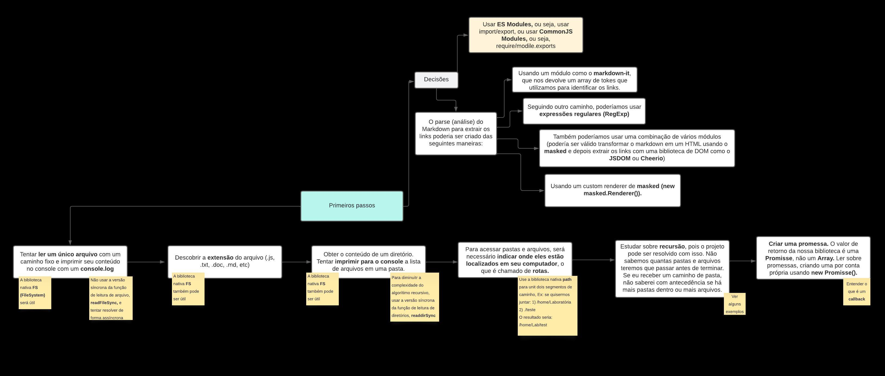

## 9. Contato

Bruna Abreu: https://www.linkedin.com/in/bru-abreu/
